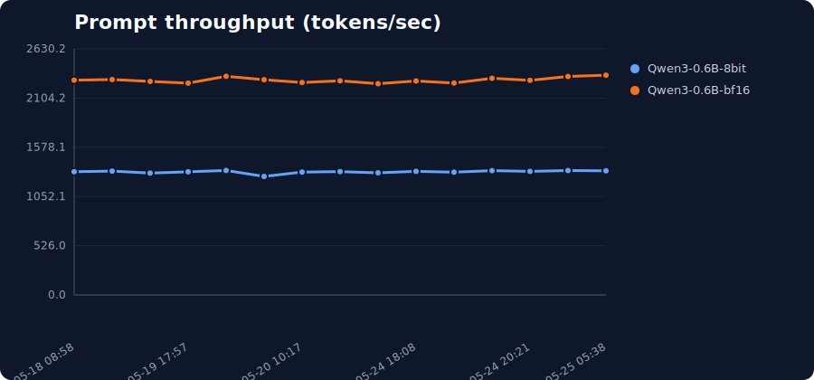
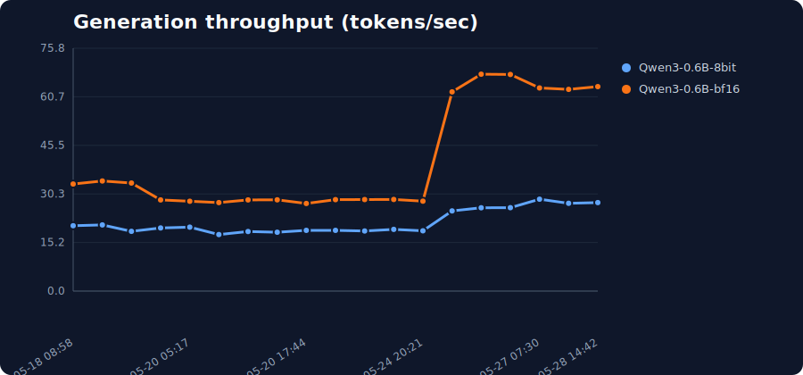

# mlx-vulkan
Home for the Development of MLX Vulkan backend

## Benchmark Results

CI benchmark history from AMD Radeon 8060S (Strix Halo). Detailed data is in `benchmarks/results.csv`.

### Latest Results

| Model | Bits | Prompt TPS | Generation TPS | Peak memory (GB) | mlx-vulkan | mlx | Run |
| --- | --- | ---: | ---: | ---: | --- | --- | --- |
| mlx-community/Qwen3-0.6B-8bit | 8bit | 1336.072 | 27.618 | 2.204 | 00dfd9c | 4a6c4a9 | [run](https://github.com/goniz/mlx-vulkan/actions/runs/26581733030) |
| mlx-community/Qwen3-0.6B-bf16 | bf16 | 2349.782 | 63.834 | 2.824 | 00dfd9c | 4a6c4a9 | [run](https://github.com/goniz/mlx-vulkan/actions/runs/26581733030) |

### Model Generation Report

Serial generation smoke tests validate that each model produces coherent output on Vulkan.

| Model | Output | Coherent | Peak memory (GB) | Sample | Error |
| --- | --- | --- | ---: | --- | --- |
| mlx-community/Qwen3-0.6B-bf16 | pass | pass | 1.151 | <think> Okay, the user wants a concise sentence about why Vulkan acceleration is useful. Let... |  |
| mlx-community/Qwen3-0.6B-8bit | pass | pass | 1.032 | <think> Okay, the user wants a concise sentence about why Vulkan acceleration is useful. Let... |  |
| LiquidAI/LFM2.5-1.2B-Instruct-MLX-8bit | pass | pass | 1.404 | Vulkan acceleration enhances performance by enabling efficient parallel processing and reduci... |  |
| mlx-community/Qwen3.5-2B-bf16 | pass | pass | 4.099 | Thinking Process: 1. **Analyze the Request:** * Task: Write one concise sentence. * Topic: Wh... |  |
| mlx-community/gemma-4-e2b-it-bf16 | pass | pass | 10.938 | Vulkan acceleration provides low-level, high-performance access to the GPU, enabling develope... |  |
| mlx-community/gemma-4-e4b-it-4bit | pass | pass | 7.466 | Vulkan acceleration provides a low-overhead, high-performance graphics API allowing developer... |  |
| mlx-community/gemma-4-26b-a4b-it-4bit | pass | pass | 15.548 | <\|channel>thought * Topic: Why Vulkan acceleration is useful. * Constraint: One concise sente... |  |
| mlx-community/Qwen3.6-35B-A3B-8bit | pass | pass | 36.382 | Here's a thinking process: 1. **Analyze User Input:** - **Topic:** Vulkan acceleration - **Re... |  |
| mlx-community/gpt-oss-20b-MXFP4-Q8 | pass | pass | 14.184 | <\|channel\|>analysis<\|message\|>We need to write one concise sentence about why Vulkan accelera... |  |
| mlx-community/Qwen3.6-27B-8bit | pass | pass | 29.242 | Here's a thinking process: 1. **Analyze User Input:** - **Topic:** Vulkan acceleration - **Re... |  |
