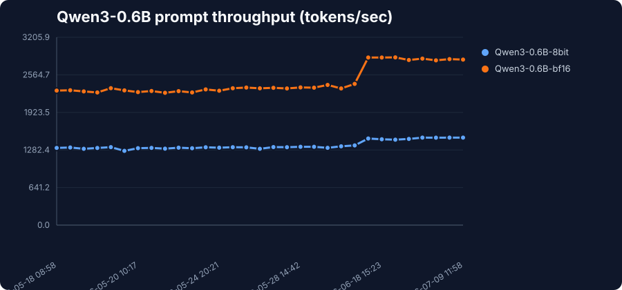
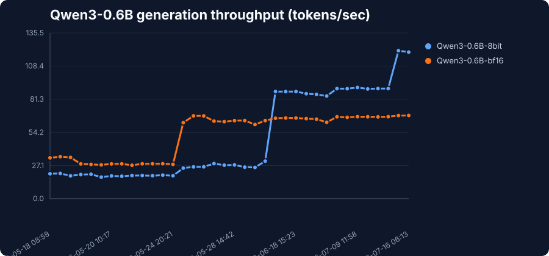
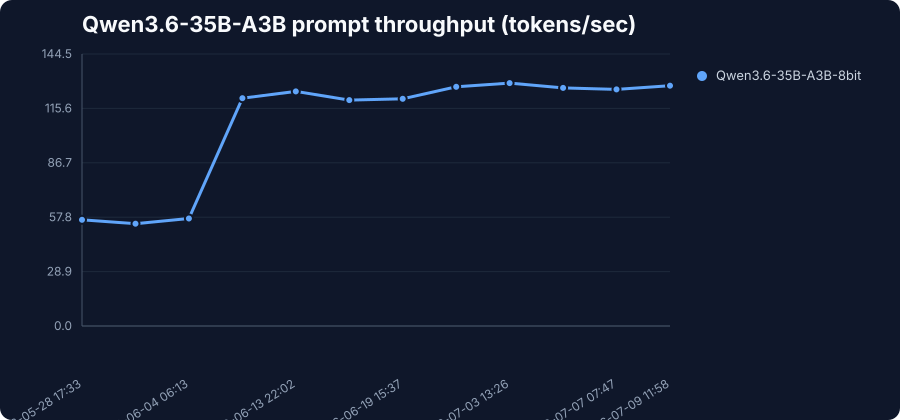
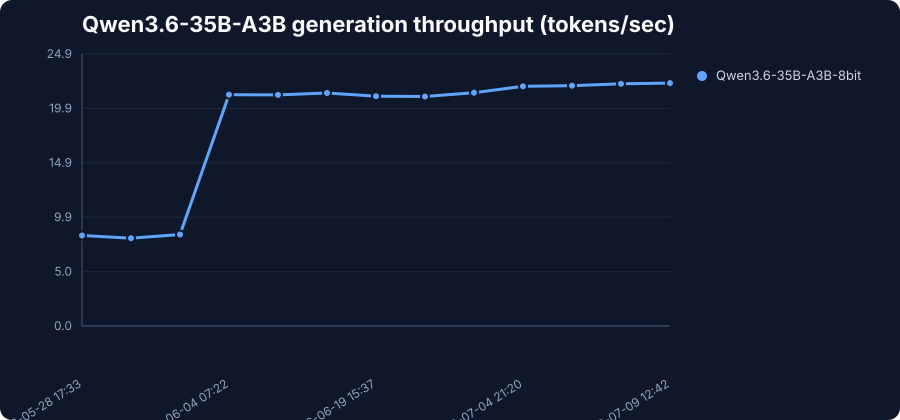

# Vulkan Benchmark History

This file is generated by `scripts/update_benchmark.py`. Do not edit it by hand.

Benchmark data is stored in `results.csv`. Graphs are regenerated from that file whenever `./dev.sh update-benchmark` runs.

## Qwen3-0.6B Prompt Throughput

## Qwen3-0.6B Generation Throughput

## Qwen3.6-35B-A3B Prompt Throughput

## Qwen3.6-35B-A3B Generation Throughput

## Latest Results

| Model | Bits | Prompt TPS | Generation TPS | Peak memory (GB) | mlx-vulkan | mlx | Run |
| --- | --- | ---: | ---: | ---: | --- | --- | --- |
| mlx-community/Qwen3-0.6B-8bit | 8bit | 2882.832 | 121.007 | 1.688 | 76e10ae | df10f7b | [run](https://github.com/goniz/mlx-vulkan/actions/runs/29409233711) |
| mlx-community/Qwen3-0.6B-bf16 | bf16 | 2949.229 | 67.981 | 2.102 | 76e10ae | df10f7b | [run](https://github.com/goniz/mlx-vulkan/actions/runs/29409233711) |
| mlx-community/Qwen3.6-35B-A3B-8bit | 8bit | 683.012 | 29.409 | 39.665 | 76e10ae | df10f7b | [run](https://github.com/goniz/mlx-vulkan/actions/runs/29409233711) |

## Model Generation Report

Generation smoke tests run with `scripts/model_generation_report.py` through `./dev.sh update-benchmark`.

| Model | Output | Coherent | Peak memory (GB) | Sample | Error |
| --- | --- | --- | ---: | --- | --- |
| mlx-community/Qwen3-0.6B-bf16 | pass | pass | 1.143 | <think> Okay, the user wants a concise sentence about why Vulkan acceleration is useful. Let... |  |
| mlx-community/Qwen3-0.6B-8bit | pass | pass | 0.624 | <think> Okay, the user wants a concise sentence about why Vulkan acceleration is useful. Let... |  |
| LiquidAI/LFM2.5-1.2B-Instruct-MLX-8bit | pass | pass | 1.183 | Vulkan acceleration enhances performance by enabling efficient parallel processing and reduci... |  |
| mlx-community/Qwen3.5-2B-bf16 | pass | pass | 3.54 | Thinking Process: 1. **Analyze the Request:** * Task: Write one concise sentence. * Topic: Wh... |  |
| mlx-community/gemma-4-e2b-it-bf16 | pass | pass | 8.639 | <\|channel>thoughting process:1. **Analyze Request:** The user wants "one concise sentence" ex... |  |
| mlx-community/gemma-4-e4b-it-4bit | pass | pass | 11.587 | <\|channel>thought 1. **Analyze the request:** The user wants *one concise sentence* explainin... |  |
| mlx-community/gemma-4-26b-a4b-it-4bit | pass | pass | 21.652 | <\|channel>thought * Topic: Why Vulkan acceleration is useful. * Constraint: One concise sente... |  |
| mlx-community/Qwen3.6-35B-A3B-8bit | pass | pass | 34.415 | Here's a thinking process: 1. **Analyze User Input:** - **Topic:** Vulkan acceleration - **Re... |  |
| mlx-community/gpt-oss-20b-MXFP4-Q8 | pass | pass | 11.436 | <\|channel\|>analysis<\|message\|>We need to write one concise sentence about why Vulkan accelera... |  |
| mlx-community/Qwen3.6-27B-8bit | pass | pass | 26.88 | Here's a thinking process: 1. **Analyze User Input:** - **Topic:** Vulkan acceleration - **Re... |  |
